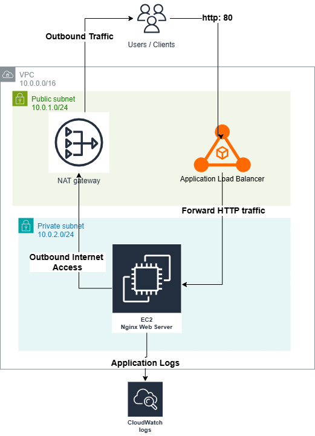

# Prueba tecnica infraestructura basica AWS

## Objetivo

Este proyecto implementa una aplicación web sencilla en AWS utilizando **Terraform** como herramienta de infraestructura como código.

El diseño fue realizado para cumplir con los requerimientos de red, seguridad básica, observabilidad y exposición de la aplicación mediante un ALB, manteniendo una arquitectura simple y fácil de desplegar.

---

## Descripción de la arquitectura

La arquitectura implementada consiste en una red privada virtual (VPC) que separa los recursos públicos y privados para mejorar la seguridad.

El **Application Load Balancer (ALB)** se encuentra ubicado en subredes públicas y es el único componente expuesto a internet. Su función es recibir las solicitudes HTTP y dirigirlas hacia la instancia EC2 que ejecuta la aplicación.

La **instancia EC2** que ejecuta la aplicación web está ubicada en una subred privada. Esta instancia ejecuta un servidor **Nginx** que responde con un mensaje simple para validar el funcionamiento de la infraestructura.

Para permitir que la instancia privada pueda instalar paquetes y actualizaciones, se implementa un **NAT Gateway**, el cual proporciona salida controlada a internet desde la subred privada.

Adicionalmente, los logs básicos del servidor web se envían a **Amazon CloudWatch Logs**, permitiendo contar con observabilidad básica de la aplicación.


---

## Diagrama de arquitectura




---

## Componentes implementados

La solución incluye los siguientes componentes de infraestructura de aws:

- VPC
- Subred pública
- Subred privada
- Internet Gateway
- NAT Gateway
- Route Tables
- Application Load Balancer
- Security Groups
- IAM Role para la instancia EC2
- Instancia EC2 con Nginx
- CloudWatch Logs
- Terraform como herramienta de infraestructura como código

---

## Decisiones técnicas

Las decisiones técnicas tomadas para esta implementación fueron las siguientes:

- Se utilizó **Terraform** como herramienta de infraestructura como código para permitir un despliegue reproducible y automatizado.
- Se eligió **EC2 con Nginx** para mantener la aplicación simple y fácil de desplegar.
- La instancia EC2 fue ubicada en una **subred privada** para evitar su exposición directa a internet.
- El **Application Load Balancer** es el único punto de entrada público hacia la aplicación.
- Se implementó un **NAT Gateway** para permitir que la instancia privada tenga acceso a internet para instalar dependencias y actualizaciones.
- Se configuraron **Security Groups** aplicando el principio de mínimo privilegio:
  - El ALB permite tráfico HTTP desde internet
  - La instancia EC2 solo acepta tráfico HTTP proveniente del ALB
- Se integró **CloudWatch Logs** para contar con observabilidad básica de la aplicación y del servidor web.

---

## Instrucciones para desplegar

### 1. Clonar el repositorio

```bash
git clone <https://github.com/jeissonjahvier10/prueba_tecnica_nuptum.git>
cd prueba_tecnica_nuptum/terraform
```
### 2. Inicializar Terraform
```bash
terraform init
```
### 3. Revisar el plan de despliegue
```bash
terraform plan
```
### 4. Aplicar la infraestructura
```bash
terraform apply
```
Terraform pedirá confirmar antes de crear los recursos. 
Escribir:
yes
### 5. Obtener la URL de la aplicación
Una vez finalizado el despliegue, ejecutar:
```bash
terraform output app_url
```
Abrir la URL en el navegador.
La aplicación debería responder con el mensaje:
Hello from AWS Infrastructure Test

### 6. Eliminación de la infraestructura
Para eliminar todos los recursos creados por Terraform ejecutar:
```bash
terraform destroy
```